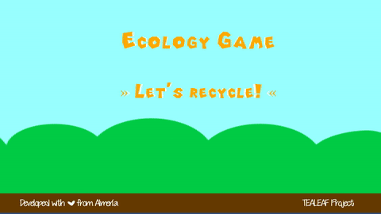
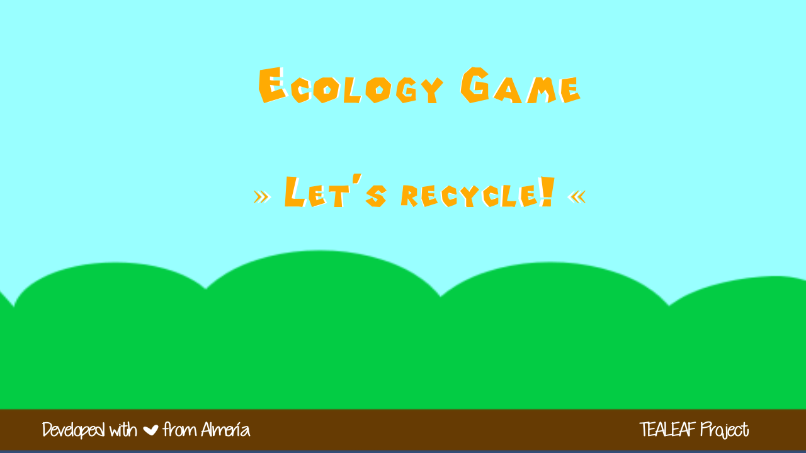
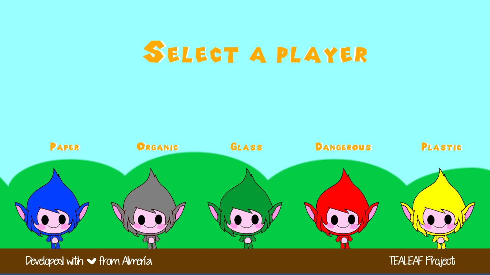
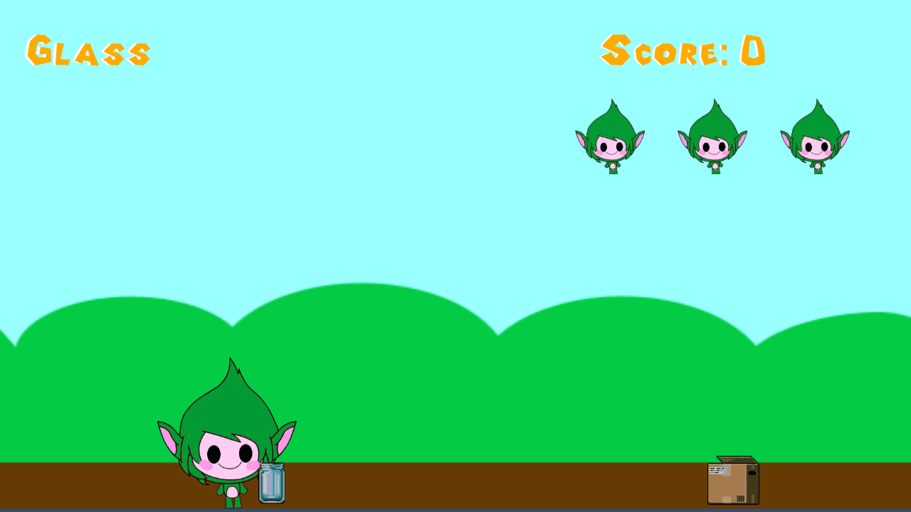
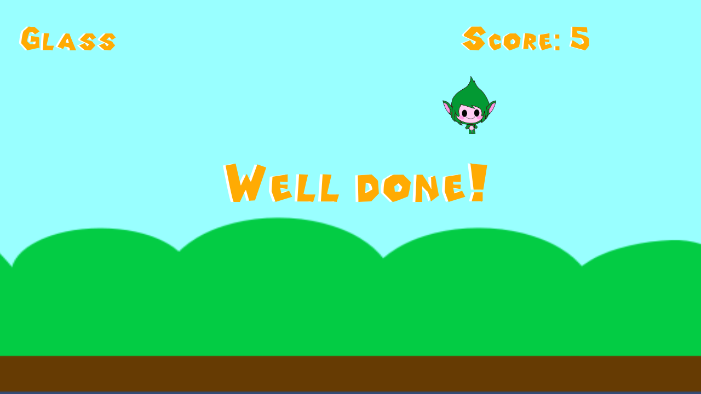

# Let's recycle!

**Let's recycle!** is a Unity game developed for the [TEALEAF Project][tealeaf-project]: «**T**eaching **E**cology through **A**pps: **L**earning **E**ngagement **A**nd **F**un».

This game is based on a [game developed in Scratch][scratch-game] by two students (Salma Ruiz Annakim and Paula Izquierdo Vargas) that are studying the first course of secondary school.

### Gameplay Demo

### Screenshots

### Credits

The first lines of code of this game were written during the [JamToday Almería 2016][jamtodayalmeria] thanks to [Juanjo Vega Gea][juanjovega] and his valuable help and support. Thanks dude, you rock! :)

### Sounds

- [negative_beeps.wav][negative_beeps.wav]. Created by [themusicalnomad][themusicalnomad].
- [jump_1.wav][jump_1.wav]. Created by [soundnimja][soundnimja].
- [piglevelwin2.mp3][piglevelwin2.mp3]. Created by [Tuudurt][Tuudurt].
- [Life Lost Game Over][Life Lost Game Over]. Created by [noirenex][noirenex].

### Audio

- [Funny Song][Funny Song] - [Bensound.com][bensound].
- [Ukelele][ukulele] - [Bensound.com][bensound].

### Fonts

- [Cutie Patootie][cutie-patootie] - [Vanessa Bays][bythebutterfly].
- [Pipe Dream][pipe-dream] - [Triforce89][triforce89].

[scratch-game]: https://scratch.mit.edu/projects/101455327/

[tealeaf-project]: https://sites.google.com/a/tealeaf-project.eu/tealeaf-project/

[juanjovega]: https://www.linkedin.com/in/juanjovega
[jamtodayalmeria]: http://jamtodayalmeria.com

[negative_beeps.wav]: https://freesound.org/people/themusicalnomad/sounds/253886/
[themusicalnomad]: https://freesound.org/people/themusicalnomad/
[jump_1.wav]: https://freesound.org/people/soundnimja/sounds/173326/
[soundnimja]: https://freesound.org/people/soundnimja/
[piglevelwin2.mp3]: http://freesound.org/people/Tuudurt/sounds/275104/
[Tuudurt]: http://freesound.org/people/Tuudurt/
[Life Lost Game Over]: http://freesound.org/people/noirenex/sounds/159408/
[noirenex]: http://freesound.org/people/noirenex/

[Funny Song]: http://www.bensound.com/royalty-free-music/track/funny-song
[bensound]: http://www.bensound.com
[ukulele]: http://www.bensound.com/royalty-free-music/track/ukulele

[cutie-patootie]: http://www.dafont.com/es/cutie-patootie.font
[bythebutterfly]: http://bythebutterfly.com
[pipe-dream]: http://www.fontspace.com/triforce89/pipe-dream
[triforce89]: http://www.fontspace.com/triforce89
